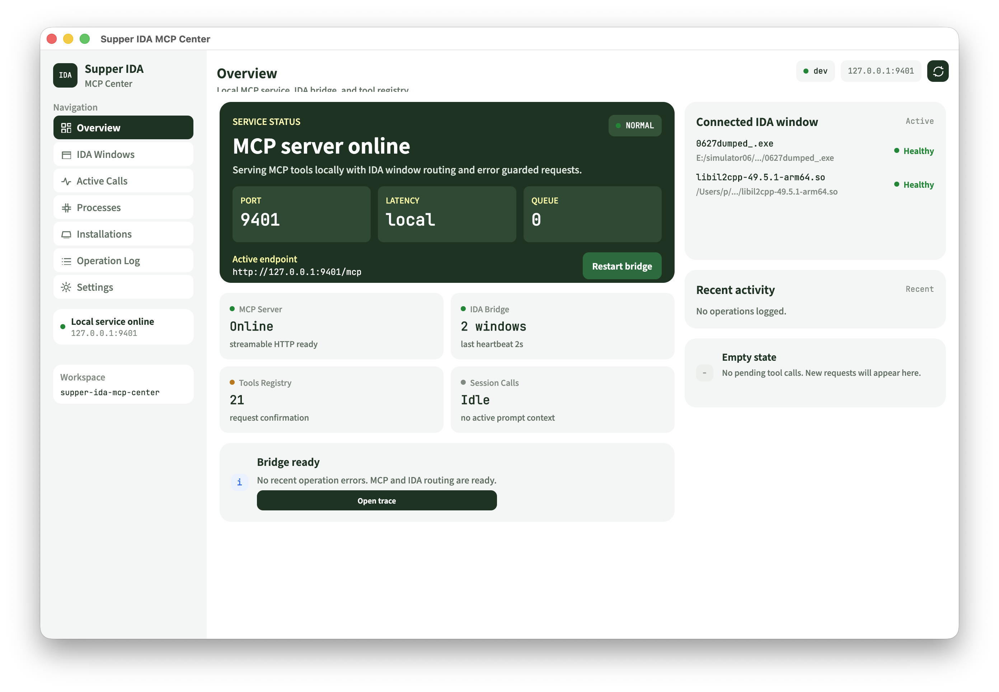
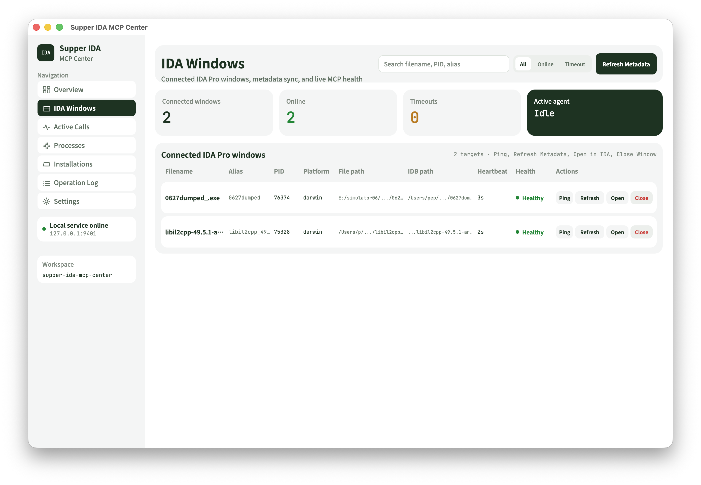
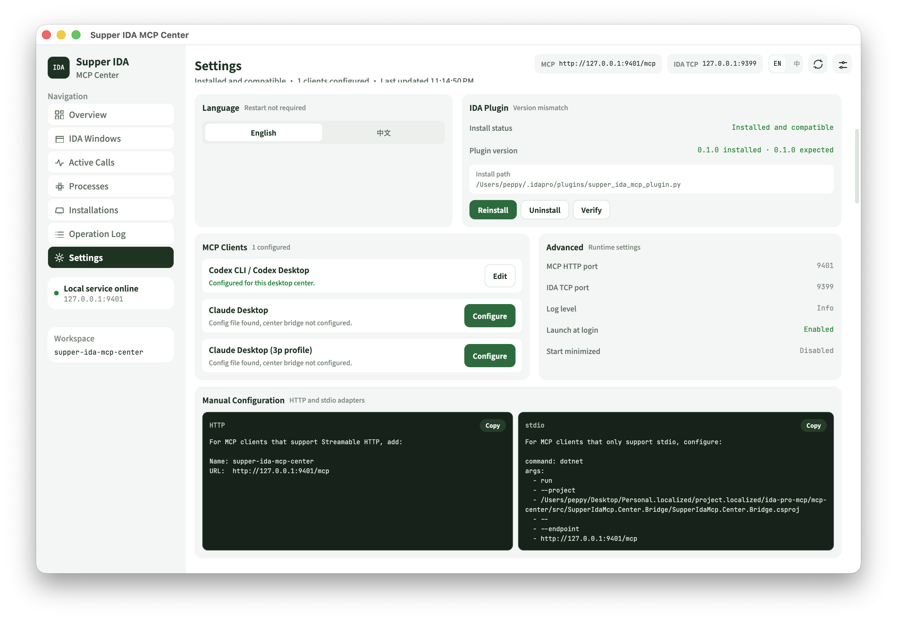
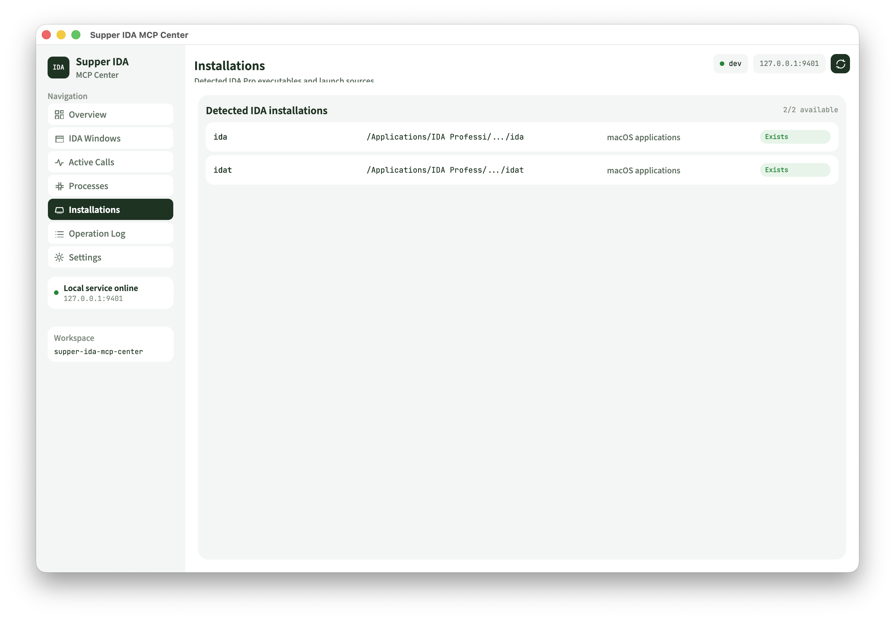
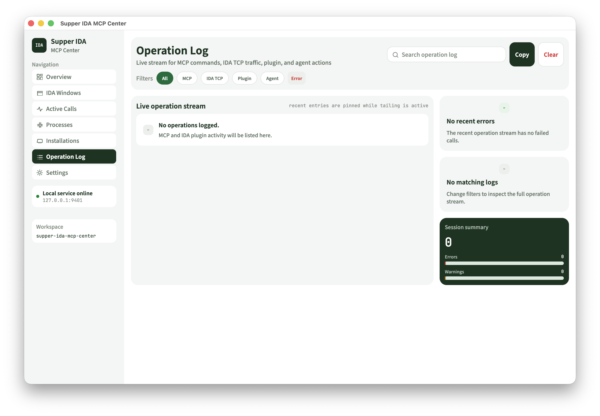
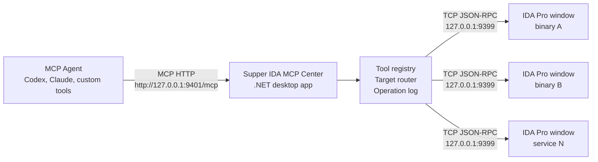
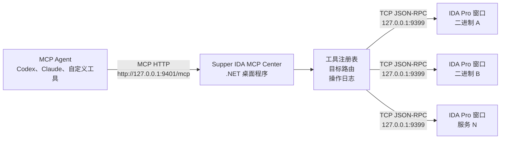

<p align="center">
  
</p>

<h1 align="center">Supper IDA MCP Tools</h1>

<p align="center">
  <strong>One desktop MCP Center for every open IDA Pro window.</strong>
  <br>
  Route agent analysis across multiple binaries, services, and IDA databases without configuring every IDA instance by hand.
</p>

<p align="center">
  <a href="#english">English</a>
  ·
  <a href="#中文">中文</a>
</p>

<p align="center">
  
  
  
  
</p>

<p align="center">
  
</p>

---

<a id="english"></a>

## English

Supper IDA MCP Tools is a cross-platform desktop control center for multi-window IDA Pro reverse engineering. Instead of exposing one MCP server per IDA window, it runs a single local MCP Center. Every IDA Pro window registers itself to the center through a lightweight TCP plugin, and your agent only connects to one stable MCP endpoint.

This is designed for real reverse engineering work: server suites, multi-process products, paired client/server binaries, shared libraries, malware families, and any analysis task where understanding one file depends on comparing it with another.

## Why It Exists

Traditional IDA MCP workflows are cramped when you need to inspect several databases at once. They usually bind the agent to one IDA window, which means target switching, tool discovery, and MCP configuration become manual overhead.

Supper IDA MCP Tools changes the topology:

- One MCP endpoint for Codex, Claude, or any MCP-capable agent.
- Many IDA windows registered into one local center.
- Explicit `instanceId` target routing for every target-specific tool.
- Desktop visibility into connected windows, health, calls, processes, installs, and logs.
- Automatic target cleanup when an IDA window exits and its TCP connection closes.
- Optional IDA auto-launch from MCP tools such as `ida_launch_file`.

## Product Tour

<table>
  <tr>
    <td width="50%">
      
      <br>
      <strong>Multi-window target registry</strong>
      <br>
      Inspect every connected IDA window, ping targets, refresh metadata, open files, and close stale windows from one place.
    </td>
    <td width="50%">
      
      <br>
      <strong>Agent and plugin setup</strong>
      <br>
      Install or repair the IDA plugin, verify compatible plugin versions, and configure Codex or Claude without hand-editing every config file.
    </td>
  </tr>
  <tr>
    <td width="50%">
      
      <br>
      <strong>IDA discovery</strong>
      <br>
      Find installed IDA executables on macOS and Windows, then launch target files from the center or from MCP tools.
    </td>
    <td width="50%">
      
      <br>
      <strong>Operation log</strong>
      <br>
      Track MCP commands, IDA TCP traffic, plugin activity, agent calls, errors, and session summaries.
    </td>
  </tr>
</table>

## Architecture



The IDA plugin does not expose MCP directly. It only connects to the local center, reports metadata and heartbeat state, executes center-issued tool calls on IDA's main thread, and returns structured results. The MCP Center owns schemas, routing, process launch, health, and logs.

## Features

- Desktop MCP Center: one product entrypoint for MCP HTTP, IDA TCP, target routing, and UI.
- Multi-target analysis: list all IDA windows and call tools against the selected `instanceId`.
- IDA plugin manager: install, repair, uninstall, version-check, and legacy plugin detection.
- Agent configuration: configure Codex CLI / Codex Desktop and Claude Desktop from Settings.
- Auto-launch support: discover IDA and open binaries with `ida_launch_file`.
- Cross-platform tray operation: run in the Windows tray or macOS menu bar.
- Local-first design: default endpoints bind to `127.0.0.1`.
- Operation visibility: active calls, process tracking, session logs, and recent errors.

## Quick Start

### 1. Clone and run the desktop center

```bash
git clone https://github.com/ThePeppy/supper-ida-mcp-tools.git
cd supper-ida-mcp-tools
dotnet run --project mcp-center/src/SupperIdaMcp.Center.Desktop/SupperIdaMcp.Center.Desktop.csproj
```

Start directly in the tray or menu bar:

```bash
dotnet run --project mcp-center/src/SupperIdaMcp.Center.Desktop/SupperIdaMcp.Center.Desktop.csproj -- --start-minimized
```

Default local endpoints:

```text
MCP HTTP:       http://127.0.0.1:9401/mcp
Health:         http://127.0.0.1:9401/health
IDA plugin TCP: 127.0.0.1:9399
```

### 2. Install the IDA plugin

Recommended: open the desktop app and use `Settings -> IDA Plugin -> Install / Repair`.

CLI install is also available:

```bash
python3 ida-plugin/install.py
```

Then restart IDA Pro. Each IDA window with the plugin loaded will automatically register to `127.0.0.1:9399`.

### 3. Configure your MCP agent once

Only configure the center. Do not configure every IDA window.

For MCP clients with Streamable HTTP support:

```text
Name: supper-ida-mcp-center
URL:  http://127.0.0.1:9401/mcp
```

Codex config example:

```toml
[mcp_servers.supper-ida-mcp-center]
url = "http://127.0.0.1:9401/mcp"
```

For stdio-only MCP clients, use the bridge:

```text
command: dotnet
args:
  - run
  - --project
  - /path/to/supper-ida-mcp-tools/mcp-center/src/SupperIdaMcp.Center.Bridge/SupperIdaMcp.Center.Bridge.csproj
  - --
  - --endpoint
  - http://127.0.0.1:9401/mcp
```

The Settings page can detect and configure supported clients automatically.

### 4. Analyze multiple IDA windows

Open several binaries in IDA Pro, or ask the agent to launch one:

```text
ida_launch_file {
  "inputPath": "/path/to/binary"
}
```

List registered targets:

```text
ida_list_targets
```

Then route target-specific calls by `instanceId`:

```text
ida_decompile {
  "instanceId": "target-instance-id",
  "query": "main"
}
```

Useful tool families:

- Target management: `ida_list_targets`, `ida_get_target`, `ida_ping_target`, `ida_get_metadata`, `ida_close_target`
- IDA launch: `ida_find_installations`, `ida_launch_file`, `ida_list_launched_processes`
- Analysis: `ida_list_functions`, `ida_get_function`, `ida_decompile`, `ida_disassemble`, `ida_xrefs`
- Data: `ida_list_strings`, `ida_list_imports`, `ida_get_bytes`, `ida_search_text`
- Editing: `ida_rename`, `ida_set_comment`
- Observability: `ida_operation_log`

## Project Layout

```text
ida-plugin/   Python plugin installed into IDA Pro
mcp-center/   .NET desktop center, MCP server, TCP hub, IDA process manager
docs/         Architecture, protocol, usage, and reference notes
images/       App icon and product screenshots
```

## Requirements

- .NET SDK 10 or newer.
- Python 3 for the IDA plugin installer.
- IDA Pro with Python support.
- macOS or Windows for the desktop app target workflow.
- An MCP-capable agent such as Codex, Claude Desktop, or a custom MCP client.

## Documentation

- [Architecture](docs/architecture.md)
- [MCP Center Usage](docs/mcp-center-usage.md)
- [Agent Configuration](docs/agent-configuration.md)
- [IDA Plugin Install](docs/ida-plugin-install.md)
- [Auto Launch IDA](docs/auto-launch-ida.md)
- [Release Workflow](docs/release-workflow.md)
- [Tool Catalog](docs/tool-catalog.md)
- [Protocol](docs/protocol.md)

## Roadmap

- Developer ID signing and notarization for public macOS distribution.
- Richer IDA analysis and modification tools.
- Update channels after the release workflow stabilizes.
- Deeper agent workflow examples for multi-service reverse engineering.
- More visual diagnostics for long-running analysis sessions.

If this project saves you time, a star helps push the work forward.

---

<a id="中文"></a>

## 中文

Supper IDA MCP Tools 是一个面向多窗口 IDA Pro 逆向分析的跨平台桌面中枢。它不再让每个 IDA 窗口各自暴露一个 MCP 服务，而是在本机运行一个统一的 MCP Center。所有 IDA Pro 窗口通过轻量 TCP 插件注册到中心，Agent 只需要连接一个稳定的 MCP 端点。

这套工具面向真实逆向工作流：服务端多进程组合、客户端/服务端联动分析、多个共享库对照、样本家族横向比较，以及任何需要同时理解多个 IDA 数据库的场景。

## 为什么需要它

传统 IDA MCP 工作流在多文件分析时很局促。Agent 通常只能绑定一个 IDA 窗口，切换目标、注册工具和配置 MCP 都会变成重复的人工操作。

Supper IDA MCP Tools 改变的是整体拓扑：

- Codex、Claude 或任何 MCP Agent 只连接一个 MCP 端点。
- 多个 IDA 窗口统一注册到本地中心。
- 每个目标相关工具都通过 `instanceId` 精确路由。
- 桌面端实时展示窗口、健康状态、调用、进程、安装位置和日志。
- IDA 窗口退出后 TCP 断开，中心会自动清理对应目标。
- 支持通过 `ida_launch_file` 等 MCP 工具自动启动 IDA 并打开文件。

## 产品界面

<table>
  <tr>
    <td width="50%">
      
      <br>
      <strong>多窗口目标注册表</strong>
      <br>
      在一个界面查看所有已连接 IDA 窗口，执行 Ping、刷新元数据、打开文件和关闭窗口。
    </td>
    <td width="50%">
      
      <br>
      <strong>Agent 与插件配置</strong>
      <br>
      安装或修复 IDA 插件，检查插件版本兼容性，并为 Codex 或 Claude 自动配置 MCP。
    </td>
  </tr>
  <tr>
    <td width="50%">
      
      <br>
      <strong>IDA 安装检测</strong>
      <br>
      自动发现 macOS 和 Windows 上的 IDA 可执行文件，并支持从中心或 MCP 工具启动目标文件。
    </td>
    <td width="50%">
      
      <br>
      <strong>操作日志</strong>
      <br>
      追踪 MCP 命令、IDA TCP 通信、插件行为、Agent 调用、错误和会话摘要。
    </td>
  </tr>
</table>

## 架构



IDA 插件本身不直接暴露 MCP。它只连接本地中心，上报元数据和心跳状态，在 IDA 主线程执行中心下发的工具调用，并返回结构化结果。MCP Center 负责工具 schema、目标路由、IDA 进程启动、健康状态和日志。

## 功能特性

- 桌面 MCP Center：统一承载 MCP HTTP、IDA TCP、目标路由和界面管理。
- 多目标分析：列出所有 IDA 窗口，并通过 `instanceId` 指定目标调用工具。
- IDA 插件管理：安装、修复、卸载、版本检查和旧插件检测。
- Agent 配置：可在 Settings 中配置 Codex CLI / Codex Desktop 和 Claude Desktop。
- 自动启动 IDA：发现 IDA 安装并通过 `ida_launch_file` 打开目标二进制。
- 跨平台托盘运行：支持 Windows 托盘和 macOS 菜单栏。
- 本地优先：默认只监听 `127.0.0.1`。
- 可观测性：活动调用、进程跟踪、会话日志和近期错误。

## 快速开始

### 1. 克隆并启动桌面中心

```bash
git clone https://github.com/ThePeppy/supper-ida-mcp-tools.git
cd supper-ida-mcp-tools
dotnet run --project mcp-center/src/SupperIdaMcp.Center.Desktop/SupperIdaMcp.Center.Desktop.csproj
```

直接启动到托盘或菜单栏：

```bash
dotnet run --project mcp-center/src/SupperIdaMcp.Center.Desktop/SupperIdaMcp.Center.Desktop.csproj -- --start-minimized
```

默认本地端点：

```text
MCP HTTP:       http://127.0.0.1:9401/mcp
Health:         http://127.0.0.1:9401/health
IDA plugin TCP: 127.0.0.1:9399
```

### 2. 安装 IDA 插件

推荐方式：打开桌面程序，在 `Settings -> IDA Plugin -> Install / Repair` 中安装或修复。

也可以使用命令行安装：

```bash
python3 ida-plugin/install.py
```

然后重启 IDA Pro。加载插件的每个 IDA 窗口都会自动注册到 `127.0.0.1:9399`。

### 3. 只配置一次 MCP Agent

只需要配置中心服务，不要给每个 IDA 窗口单独配置 MCP。

支持 Streamable HTTP 的 MCP 客户端：

```text
Name: supper-ida-mcp-center
URL:  http://127.0.0.1:9401/mcp
```

Codex 配置示例：

```toml
[mcp_servers.supper-ida-mcp-center]
url = "http://127.0.0.1:9401/mcp"
```

仅支持 stdio 的 MCP 客户端可使用桥接程序：

```text
command: dotnet
args:
  - run
  - --project
  - /path/to/supper-ida-mcp-tools/mcp-center/src/SupperIdaMcp.Center.Bridge/SupperIdaMcp.Center.Bridge.csproj
  - --
  - --endpoint
  - http://127.0.0.1:9401/mcp
```

Settings 页面可以检测并自动配置受支持的客户端。

### 4. 同时分析多个 IDA 窗口

在 IDA Pro 中打开多个二进制，或者让 Agent 自动启动：

```text
ida_launch_file {
  "inputPath": "/path/to/binary"
}
```

列出已注册目标：

```text
ida_list_targets
```

之后通过 `instanceId` 路由到具体 IDA 窗口：

```text
ida_decompile {
  "instanceId": "target-instance-id",
  "query": "main"
}
```

常用工具分类：

- 目标管理：`ida_list_targets`、`ida_get_target`、`ida_ping_target`、`ida_get_metadata`、`ida_close_target`
- IDA 启动：`ida_find_installations`、`ida_launch_file`、`ida_list_launched_processes`
- 分析能力：`ida_list_functions`、`ida_get_function`、`ida_decompile`、`ida_disassemble`、`ida_xrefs`
- 数据读取：`ida_list_strings`、`ida_list_imports`、`ida_get_bytes`、`ida_search_text`
- 数据库修改：`ida_rename`、`ida_set_comment`
- 可观测性：`ida_operation_log`

## 项目结构

```text
ida-plugin/   安装到 IDA Pro 的 Python 插件
mcp-center/   .NET 桌面中心、MCP 服务、TCP Hub、IDA 进程管理
docs/         架构、协议、使用说明和参考文档
images/       应用图标和产品截图
```

## 环境要求

- .NET SDK 10 或更新版本。
- Python 3，用于 IDA 插件安装脚本。
- 支持 Python 的 IDA Pro。
- macOS 或 Windows，用于桌面端主工作流。
- 支持 MCP 的 Agent，例如 Codex、Claude Desktop 或自定义 MCP 客户端。

## 文档

- [架构说明](docs/architecture.md)
- [MCP Center 使用说明](docs/mcp-center-usage.md)
- [Agent 配置](docs/agent-configuration.md)
- [IDA 插件安装](docs/ida-plugin-install.md)
- [自动启动 IDA](docs/auto-launch-ida.md)
- [发布工作流](docs/release-workflow.md)
- [工具目录](docs/tool-catalog.md)
- [协议说明](docs/protocol.md)

## 路线图

- 面向公开分发的 Developer ID 签名和 notarization。
- 更完整的 IDA 分析和数据库修改工具。
- 更完善的发布自动化和更新通道。
- 面向多服务逆向分析的 Agent 工作流示例。
- 更强的长时间分析会话可视化诊断能力。

如果这个项目节省了你的逆向分析时间，欢迎点一个 Star 推动它继续完善。
